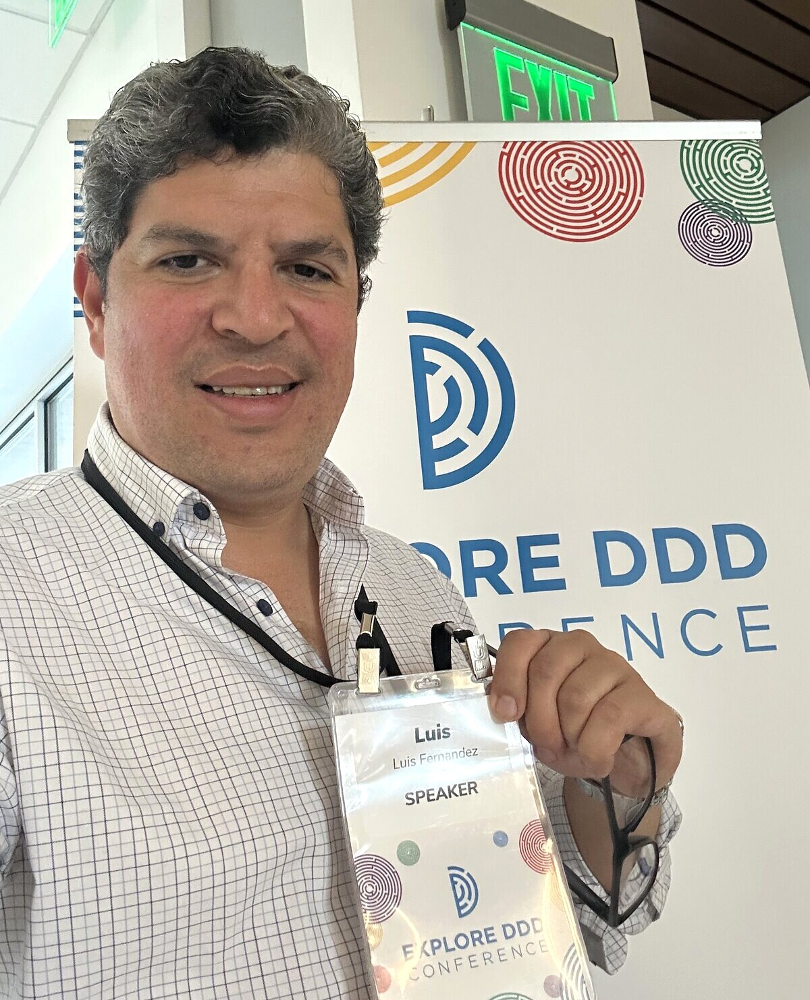
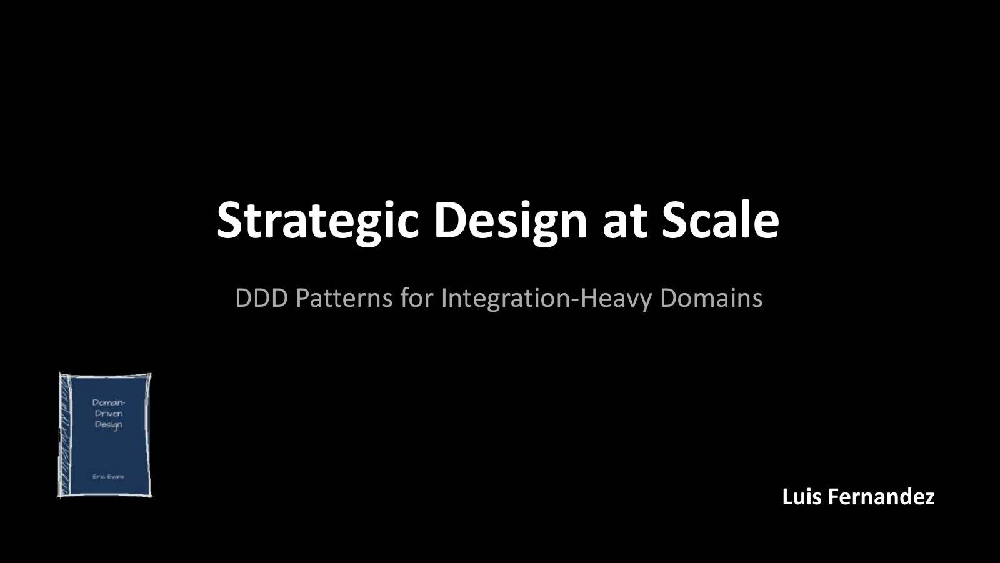
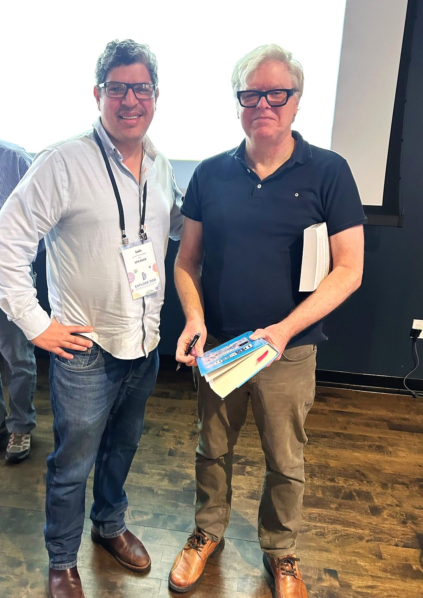
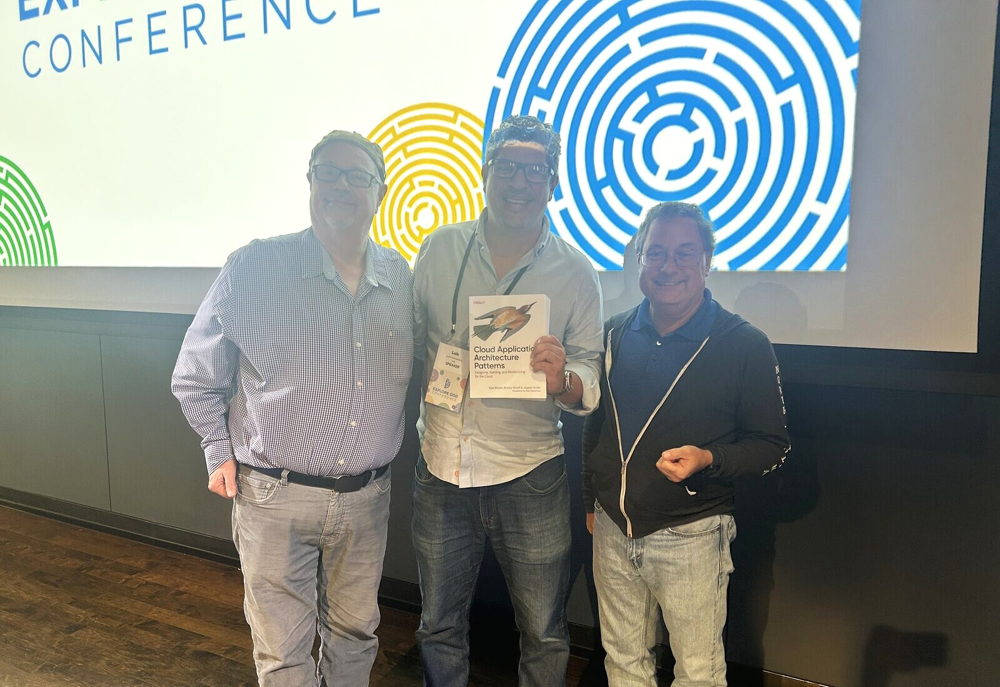

**Explore DDD 2026 — Denver, September 2026** ([slides](strategic-design-at-scale-slides.pdf))

Explore DDD was a bucket-list conference for me. I got my copy of the blue book almost two decades ago, and it shaped how I think about systems ever since. Spending three days at CSU Spur with the people who wrote the books I learned from, and getting to present my own take on strategic design, was a real treat.

## The Talk

**"Strategic Design at Scale: DDD Patterns for Integration-Heavy Domains"** — presented at [Explore DDD](https://exploreddd.com/), Denver, September 23–25, 2026.

> "How do I model a domain that has already been modeled fifteen different times?"

[**Download the slides (PDF)**](strategic-design-at-scale-slides.pdf)

### Synopsis

I still remember getting my copy of Evans' book almost two decades ago. It resonated immediately. This was, and is, the way to build systems. Then, through different iterations, I ended up in a world where the domain is even more complex, usually multi-layered, but where I don't get to choose the standards, the integrations, or many other aspects of the architecture. A variety of pre-packaged domains and systems: CRMs, CMS, CDPs, ERPs, Commerce Engines, DAMs, API Gateways, custom solutions, PIMs. Sometimes the integrations are clunky. Sometimes we get to change them. But many of the core principles of DDD still apply, just through a different lens.

After building hundreds of marketing technology ecosystems, I've learned that DDD strategic thinking becomes more valuable in integration-heavy domains, not less. But the challenges shift. How do you establish bounded contexts when vendor platforms define your boundaries? How do you speak a ubiquitous language across business stakeholders, compliance officers, vendor support teams, and distributed engineering groups? How do you lead architectural decisions when authority is fragmented across platform owners, security teams, and business units? And how do you make decisions today that won't become technical debt tomorrow?

### What we covered

- **Complicated vs. complex.** Why that humble website turned out to be both, and how accidental complexity plus time hardens into constraint.
- **Six anti-patterns** of integration-heavy domains: procurement-driven design (the RFP priced the boxes), the org chart becoming the domain map, "product = bounded context", "integration is plumbing", architecture wallpaper, and "the platform will solve it".
- **The modeler as strategist.** Architecture work is about systems, components, and interfaces. Strategic modeling is about meaning, boundaries, relationships, constraints, and choices.
- **Four patterns that work:** capability first, product second; own the boundary; not all squares are the same size; and Strategic Decision Records (SDRs) that keep the *why* next to the ADRs that keep the *how*.
- **Five questions for any boundary:** What does this mean here? Who owns the model? What happens at the boundary? What constraint created this? Is this boundary intentional?

DDD does not remove complexity. It gives us ways to reason about it. Do our platforms implement our domains, or define them? Where does meaning live?

### From the conference

That book made me look good for twenty years. Getting it signed by Eric Evans was a moment.

With Joseph Yoder and Kyle Brown and my copy of *Cloud Application Architecture Patterns*.
