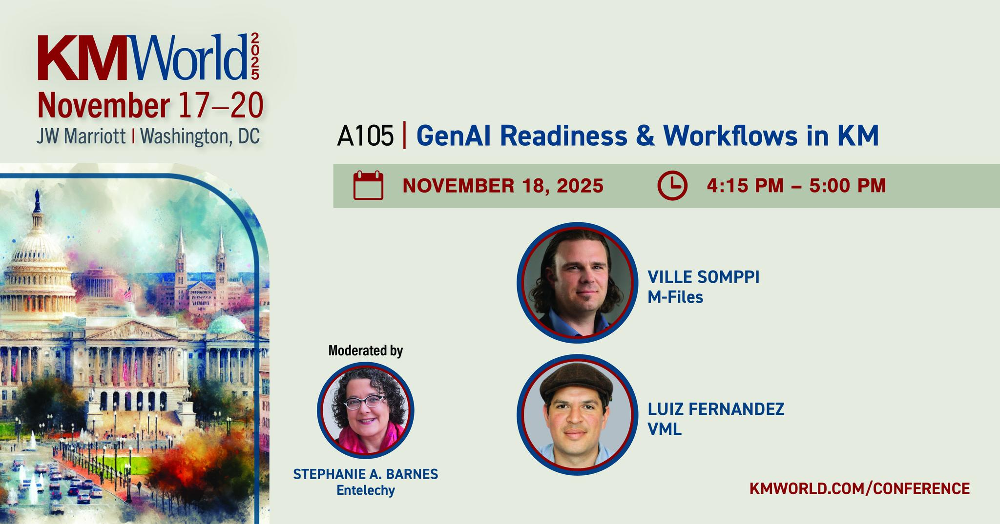
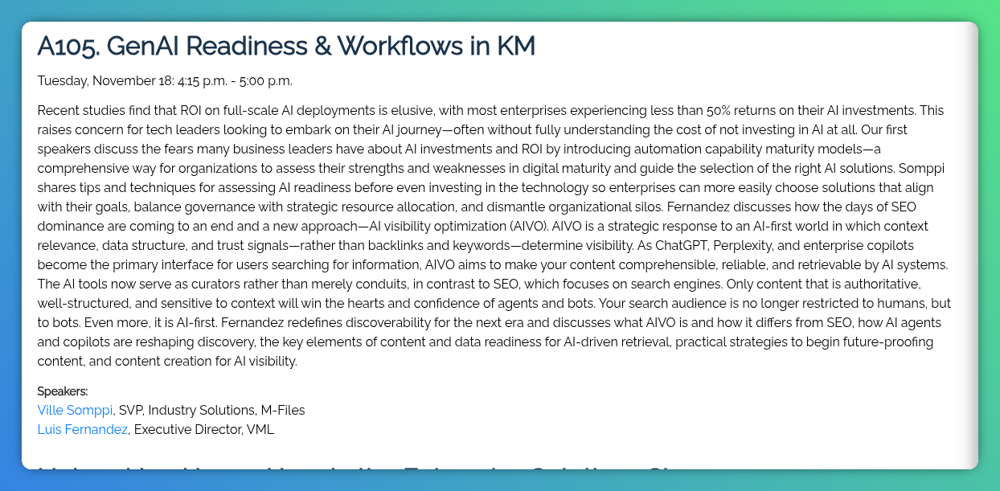

**KMWorld 2025 — Washington, D.C., November 2025**

[Conference page](https://www.kmworld.com/Conference/2025/Luis-Fernandez.aspx)

AI visibility optimization (AIVO). AIVO is a strategic response to an AI-first world in which context relevance, data structure, and trust signals—rather than backlinks and keywords—determine visibility. As ChatGPT, Perplexity, and enterprise copilots become the primary interface for users searching for information, AIVO aims to make your content comprehensible, reliable, and retrievable by AI systems. The AI tools now serve as curators rather than merely conduits, in contrast to SEO, which focuses on search engines. Only content that is authoritative, well-structured, and sensitive to context will win the hearts and confidence of agents and bots. Your search audience is no longer restricted to humans, but to bots. Even more, it is AI-first.

### What You'll Learn

- What AIVO is and how it differs from SEO
- How AI agents and copilots are reshaping discovery
- The key elements of content and data readiness for AI-driven retrieval
- Practical strategies to begin future-proofing content
- Content creation for AI visibility

### As featured in the conference program

