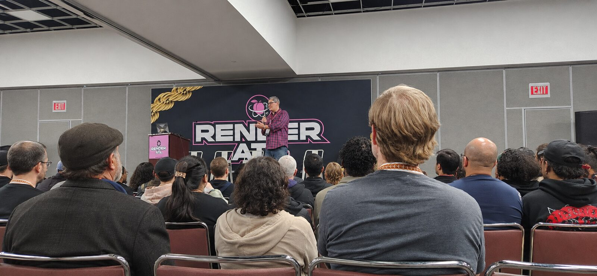
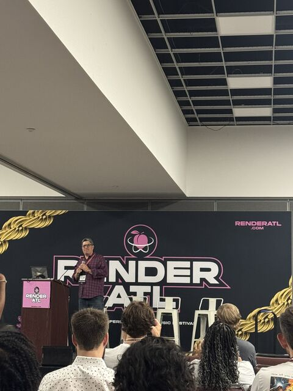
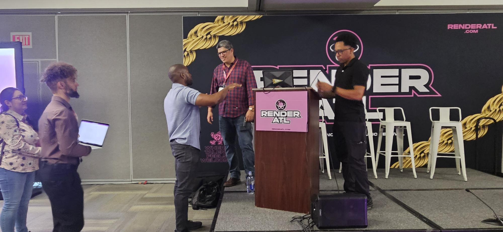
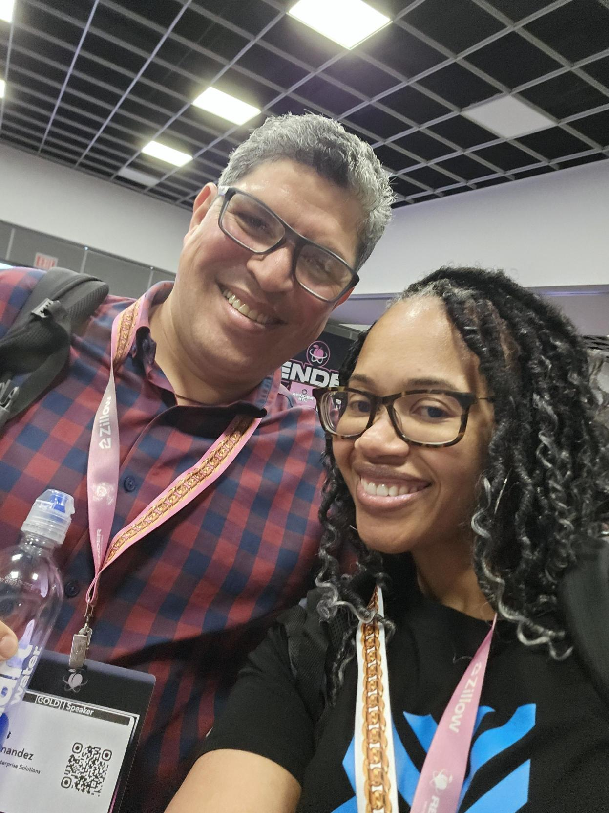
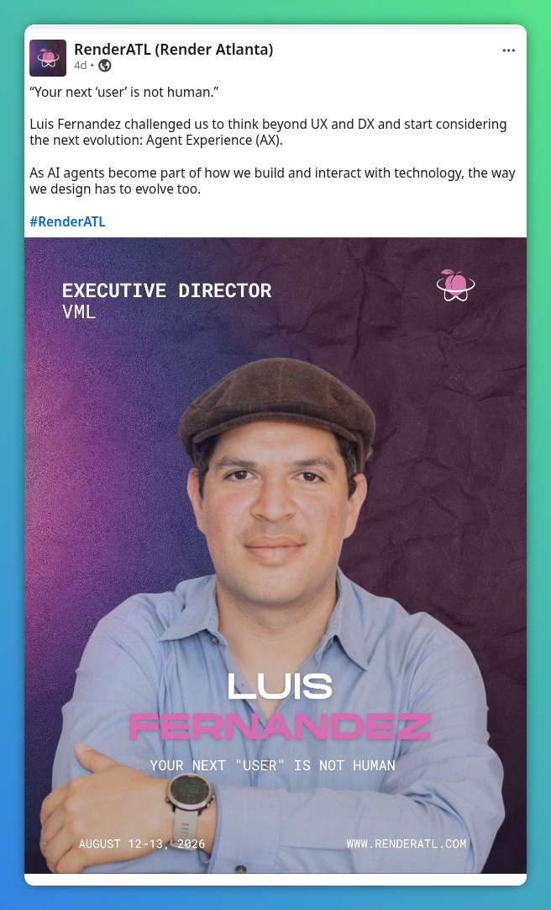
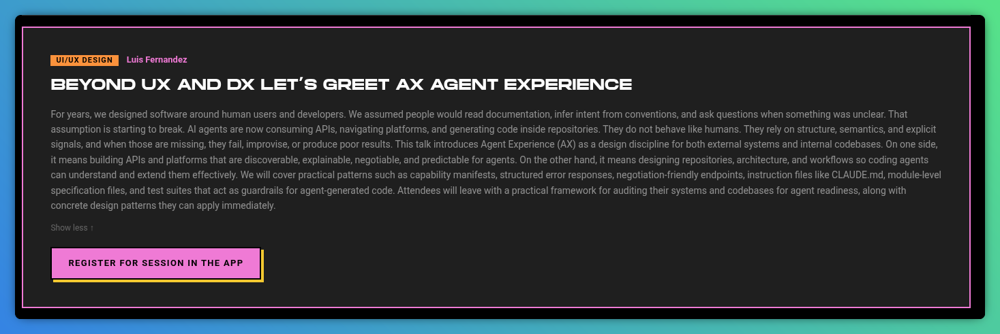

**RenderATL — Atlanta, August 2026**

Enjoying a lot being in Atlanta for my first Render. The energy was amazing, and the people I met too. Unfortunately, the audiovisuals didn't work, but we made it "a capela" and it went fantastic. Thanks to all the VMLers that attended and cheered.

## The Talk

**"Beyond UX and DX: Let's Greet AX (Agent Experience)"** — presented at [RenderATL](https://www.renderatl.com/), August 12–13, 2026.

> "Your next 'user' is not human."

[**View the slides**](/speaking/render-atl-2026/slides.html)

### Synopsis

For years, we designed software around human users and developers. We assumed people would read documentation, infer intent from conventions, and ask questions when something was unclear. That assumption is starting to break. AI agents are now consuming APIs, navigating platforms, and generating code inside repositories. They do not behave like humans. They rely on structure, semantics, and explicit signals, and when those are missing, they fail, improvise, or produce poor results.

This talk introduces Agent Experience (AX) as a design discipline for both external systems and internal codebases. On one side, it means building APIs and platforms that are discoverable, explainable, negotiable, and predictable for agents. On the other hand, it means designing repositories, architecture, and workflows so coding agents can understand and extend them effectively.

We covered practical patterns such as capability manifests, structured error responses, negotiation-friendly endpoints, instruction files like CLAUDE.md, module-level specification files, and test suites that act as guardrails for agent-generated code. Attendees left with a practical framework for auditing their systems and codebases for agent readiness, along with concrete design patterns they can apply immediately.

### From the Session

### As featured by the conference

