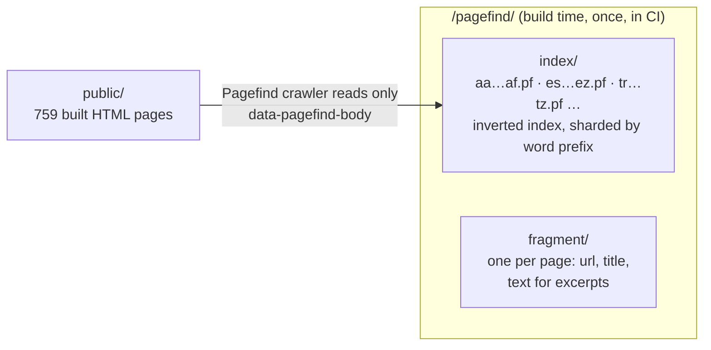
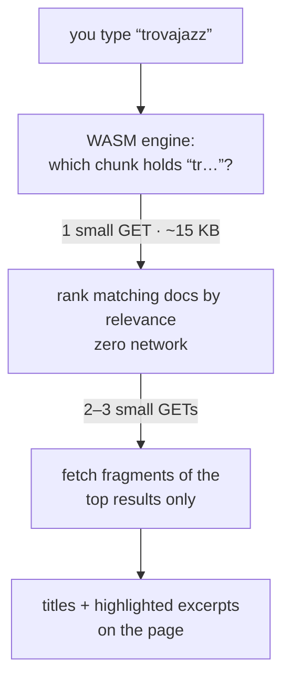

*Working document — the architecture notes behind this site's search.*

I have this type of obsession for statically generated sites. For a wide range of cases they work even better than dynamically generated ones: they are easier to maintain, and they scale easily. On top of that, they are easy to deploy, and very cheap to host (the one you are reading is hosted statically on an S3 bucket). One drawback, though, is that you don't get server functionality (duh!), like searching. But, yes, there are workarounds.

I started with what I've worked with in the past, Algolia. Although I love it, and it works really well, it is more on the enterprise side of things. It carries a cost, and brings some complexity to the static site, which defeats the purpose... and of course, the geekiness of finding a "static" solution. Sometimes our tech brains are stubborn.

Then I played with [Fuse.js](https://www.fusejs.io/), and it worked well. I first came across it inside a Hugo theme plugin in the form of a setup where Hugo emits an `index.json` of every post and Fuse does fuzzy matching over it in the browser. I still use it in some projects, and for small corpora it's genuinely great: zero infrastructure, forgiving of typos, one script tag. But it has a structural problem: the *entire* index ships to the browser before anyone types a letter, and every keystroke runs a fuzzy scan over the whole thing in main-thread JavaScript. On a site this size that meant megabytes up front and, sometimes, a visibly unresponsive page while it chewed. I ended up restricting it to titles and summaries, which is not really search — it's autocomplete wearing a trench coat.

Then I came across [Pagefind](https://pagefind.app/), and the trade it makes is exactly the right one: full-text search over the whole corpu:: s, while the browser downloads only slivers of the index. No monthly bill, no backend, no main-thread meltdown, works with any static generator, and it indexes what readers actually see. Here is why, and how it works.

The bar I wanted to clear was real full-text — not title matching, but *find-that-phrase-I-wrote-in-2008* search across two decades of posts. Fuse had already taught me that shipping the whole index doesn't survive contact with a corpus like this, and a search Lambda means owning a backend again — cold starts, IAM, a thing that pages me. The interesting question was whether "static" could clear that bar at all. It can, and the idea behind how is good enough that I want to write it down.

## The core move: shard the index by word prefix

Every search engine builds an **inverted index** — a map from words to the documents containing them. The static-site problem isn't building that map; it's that the browser can't afford to download all of it.

Pagefind's insight: split the index into chunks *by how words start*, so a query only needs the chunk that could contain it.

The full index for this site is ~4 MB sitting on S3. A search touches maybe 50 KB of it. That asymmetry is the whole trick: the database lives on the CDN, and queries are just static file GETs — cached at the edge like everything else here. Compare that with the Fuse approach, where the 4 MB *is* the download.

## The details that made me respect it

**Scoping is an HTML attribute.** Pagefind only reads elements marked `data-pagefind-body` — and if any page has one, unmarked pages are excluded entirely. I put the attribute on post bodies and nowhere else, and got three properties for free: list pages don't pollute results, legacy pagination duplicates are invisible, and the private family album never enters the index. I verified that last one by decompressing the index fragments and grepping. Search is a leak vector people forget; an index is a copy of your content.

**It's multilingual by accident of design.** This site mixes Spanish and English in one archive, sometimes in one post. Because Pagefind indexes rendered text and does stemming per detected language, both halves of my corpus are searchable in the same box. `mar muerto` and `dead sea` each find their own posts.

## The economics

The stack note stands: this site costs under $3 a month. Search added zero to that. The index is ~4 MB of storage (nothing), queries are a few KB of CDN egress (nothing), and the compute is the reader's own browser. Compare: Algolia's free tier caps requests and wants a logo; a search Lambda is cold starts plus IAM plus a thing that pages me. The static answer wins on the same grounds it always wins here — the fewest moving parts between a question and its answer.

## Drawbacks, and when not to use it

Being honest about the trade, because there is one:

- **The index is public.** Anyone can download `/pagefind/` and reconstruct the searchable text of your entire site. For a public blog that's a shrug — Google already has a copy. For paywalled or authenticated content it's disqualifying: never index what the reader shouldn't already have.
- **No typo tolerance.** The ranking is term-frequency math, not fuzzy matching. Search `trovajaz` and you get nothing; Fuse would have forgiven it, Algolia definitely would. Prefix matching softens this while you type, but a committed typo is a dead end. It's funny to think how complex it was a few years ago to deal with a Solr server to provide fuzzy search, and now it is a given. I do think that at some point we will have some sort of mini LLMs that wil help on that. 
- **Search lags publishing.** The index is rebuilt at deploy time, so content is searchable only after the next build. Irrelevant for a blog; fatal for news, forums, or anything user-generated where "searchable in seconds" is the contract.
- **No analytics, no merchandising.** You will not know what people searched for unless you bolt on your own telemetry, and you can't pin results, boost products, or tune synonyms. If search *is* the business — e-commerce, docs portals with support deflection targets — you want Algolia, Typesense, or Elastic, and the bill is justified.
- **JavaScript required.** No-JS readers get a graceful nothing. The content itself stays crawlable (search engines index the HTML, not through Pagefind), but the search box is dead weight without JS.

The pattern: Pagefind is the right answer when search is a *reader convenience* on public, deploy-published content. It's the wrong answer when search is a *product surface* — personalized, faceted, real-time, or gated.

## Open questions

- Excerpt quality depends on how the text was written. Fixing twenty years of paragraph formatting made the excerpts dramatically better — the index is only as good as the corpus.
- Per-page language tagging would sharpen stemming (`lang` is site-wide today). Worth it if Spanish recall ever feels off.
- The index rebuilds fully on every deploy. At 0.7 seconds I don't care; at 10,000 pages I might.
